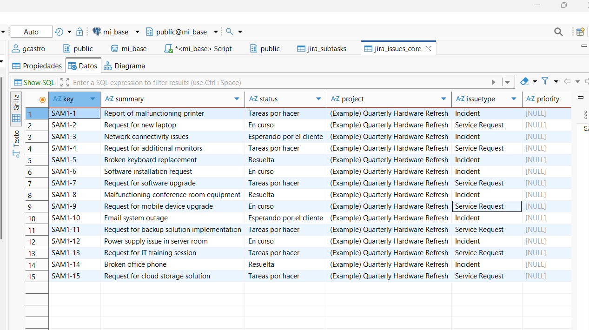
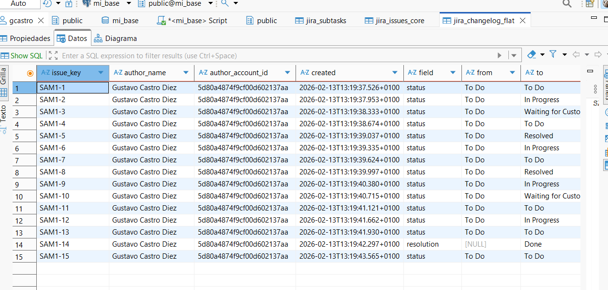
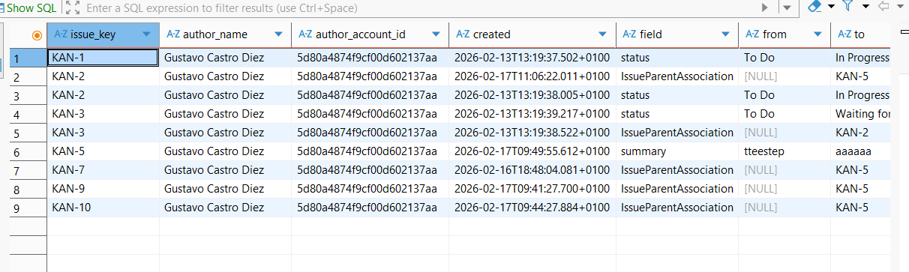
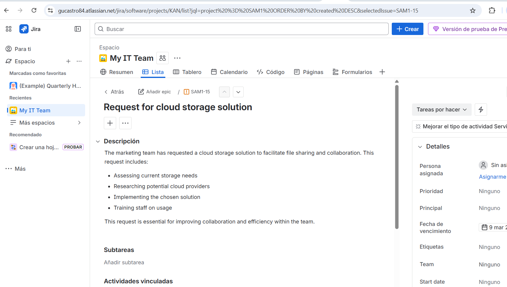

# JIRA-to-Database Import

##isntalar poetry
curl -sSL https://install.python-poetry.org | python3 -
echo 'export PATH="$HOME/.local/bin:$PATH"' >> ~/.bashrc
source ~/.bashrc

poetry install
poetry run python main.py

